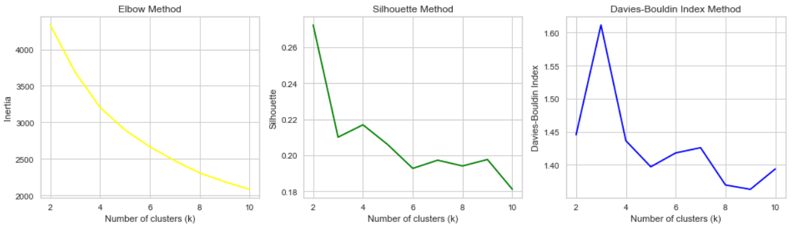
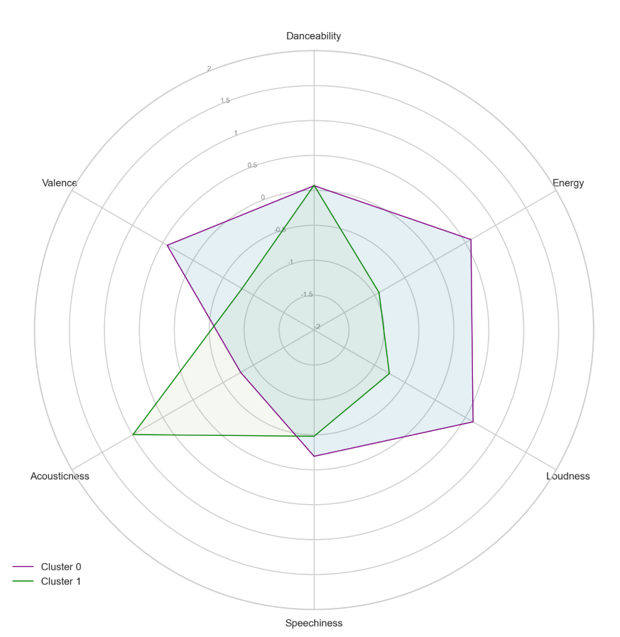
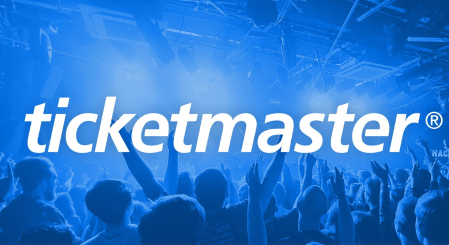

# Final Project: Your Music Your World

**Objective**: This data analytical project provides a personalized experience that caters to your musical tastes and interests, allowing you to discover your playlists and attend concerts that you are sure to enjoy.

On the one side, this project aims to analyze your music preferences by extracting information from your liked songs on Spotify and creating playlists based on clusters of song features.

In a previous ETL project [Project Top_Songs_Artists](https://github.com/elisagomezcambronero/Project-Top_Spotify_Songs_and_Artists), we discovered that human taste in music can change. Using Spotify's top charted songs list for 2020 and 2021, we observed that popularity characteristic values can vary depending on the season: people tend to listen to more acoustic and slow music during colder seasons.

This leads us to think that we sometimes have two different moods: one more melancholic and sad, and another more upbeat and cheerful. This project is based on this analogy to cluster your liked songs on [Spotify](https://open.spotify.com/search) into two different groups. It will recommend personalized playlists for your two different moods: one more tranquil and melancholic that favors slow music, and another more motivated, cheerful, and happy that favors energetic music.

In addition to recommending playlists, the application also uses the [Ticketmaster](https://www.ticketmaster.es/?gclid=bc4ecf828ef016c21536abc324ec4253&gclsrc=3p.ds&&camefrom=CFC_ES_adwords-search_brand) API to suggest concerts in your area that feature your favorite artists. This feature allows you to attend concerts that match your musical preferences

## Repository Structure
---
This proyect is structured with the following folders:

- [Data folder](data): Contains all the dataset files used for this project.
- [Images folder](folder): you will find all the images related to this project.
- Notebook folder: inside this folder you will find the following jupyter notebooks: 
    - [*Spotify Songs you Like*](notebook/Spotipy%20Songs_you_like.ipynb): notebook that connects to spotify to extract you liked songs information dataset.  
    - [*Clustering by Features*](notebook/Clustering%20by%20features.ipynb): notebook for the clustering of liked songs on Spotify.
    - [*Create Spotify Playlist*](notebook/Create%20Spotify%20Playlist.ipynb) : Notebook that connects to your spotify to create your clustered playlist.
    - [*Ticketmaster*](notebook/Ticketmaster.ipynb): Notebook that extracts the information of ticketmaster events related to your liked artists.
- [src](src): a .py file with functions used in this project:
    - *cluster*: functions for *Clustering by Features* notebook.
    - *playlist*: functions for *Spotify Songs you Like & Ticketmaster* notebook.
    - *ticketmaster*: functions for *Ticketmaster * notebook.

## Data Extraction
---
For this proyect the following APIs were use in order to extract relevant information for the analysis:

- Spotify: **"Songs You Like"**
This dataset includes information about liked songs using [Spotify API](https://developer.spotify.com/)

- Ticketmaster: **"df_events"**
This dataset includes information about ticketmaster events related to your Spotify liked artists using [Ticketmaster API](https://developer.ticketmaster.com/products-and-docs/apis/discovery-api/v2/#anchor_find)

## Clustering Spotify
---
In this project, an unsupervised machine learning clustering method with sklearn KMeans was used to segment your liked songs on Spotify. The clustering was done based on the features of the songs, and after analyzing the metrics:

 it was evaluated that the most optimal approach was to create two clusters, one for your saddest self and one for your most active self.

The result of the metric distribution was as follows:

 where the more upbeat features were clearly differentiated from the more tranquil ones.

## Searching for events on Ticketmaster
---

Based on the data previously extracted from Spotify, the artists with related events were analyzed first, and then displayed in the tool used to visualize this project: Streamlit. There, you can filter by characteristics to find events that may interest you.

## Visualisation
___
This project will be presented using the Streamlit visualization tool. Firstly, you will find a summary of the previously explained analysis, followed by a section where you can view the events that interest you. The Streamlit app is structured with a sidebar where you can navigate through different pages of the analysis and filter events.

## Acknowledgements 
---
I would like to thank Ironhack, Tech School, and especially my teachers Ana and Jean-Charles, as well as my project tutor Cesar, for providing me with the knowledge, tools, and assistance to make this project possible. Also for making me discover the amazing world of data science!

## Tools
---
Data manipulation libraries:
- [Pandas](https://pandas.pydata.org/)
- [NumPy](https://numpy.org/)
- [datetime](https://docs.python.org/3/library/datetime.html)

Machine learning libraries:
- [scikit-learn](https://scikit-learn.org/)
- [Yellowbrick](https://www.scikit-yb.org/en/latest/)
- [cluster](https://pypi.org/project/cluster/)

Visualisation libraries:
- [Matplotlib](https://matplotlib.org/)
- [Seaborn](https://seaborn.pydata.org/)
- [Plotly Express](https://plotly.com/python/plotly-express/)
- [folium](https://python-visualization.github.io/folium/)

Other Tools:
- [Streamlit](https://streamlit.io/)
- [SciPy](https://www.scipy.org/)
- [streamlit](https://streamlit.io/)
- [dotenv](https://pypi.org/project/python-dotenv/)
- [spotipy](https://spotipy.readthedocs.io/en/latest/)

